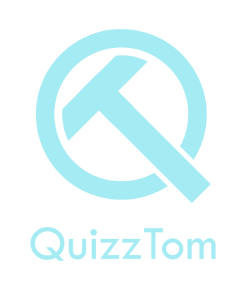
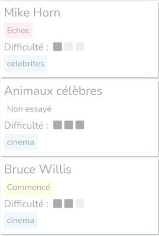
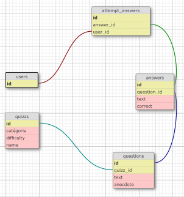

## Bienvenu dans QuizzTom
QuizzTom est une application qui propose 46 quizz. 
Les quizz sont repartis dans 13 catégories :

- Animaux
- Archeologie
- Art
- Bd
- Celebrites
- Cinema
- Culture_generale
- Geographie
- Gastronomie
- Histoire
- Litérature
- Musique
- Nature

les quizzs sont aussi caractérisé par trois niveaux de difficulté : 

- Débutant
- Confirmé
- Expert

# Extrais de la liste des quizzs de l'application



## Modèle de donnée

J'ai créé cinq modèles pour structurer l'application :



- Quizz
- Question
- Answer
- AttemptAnswer
- User

## Setup

To launch the application, you can run the following comand lines
```
cd test-technique-study-advisor
```
```
bundle install
```

Then kickstart the database

```
rails db:create
rails db:migrate
rails db:seed
```

Your are all set to try all the  quizzes.

## Guidelines
- Fork this repository
- You can add any framework, library or plugin you'd like
- In short: Do whatever you want to get the job done
- Make sure the application works out-of-the box once you're done
- Push changes to your git fork
- Add a short description on how to run your program in the Setup section above. (A person ariving new to the project should be able to follow your instructions and run it)
- Check the finished features in the Assignment and Bonus section by putting an 'X' ([X]) in between the brackets
- Quality over quantity, better half of the features 100% done, than 100% of the features half-done
- Assignment :
  - You are asked to build a simple Quizz App

## User
 [X] A user can log in with a valid username and password through a login screen

 [X] A user can see a collection of quizzes

 [X] A user can start a quizz

 [X] A user can answer 3 questions on a quizz

 [X] A user can see the scores of his quizzes


## Quizz
 [X] A quizz has a Title

 [X] A quizz has a maximum of 3 questions

 [X] A quizz is considered passed if +60% of questions are answered correctly

## Question
 [X] A question has a maximum of 4 answers

 [X] A question has only 1 possible correct answer


## Bonus
- Some nice to haves, when there is time to spare.

 [X] A quizz can have a dificulty level

 [ ] Add admin role

 [ ] A user with admin role can create and edit quizzes

 [X] A user can come back to a started quizz at the question he stopped

 [ ] Add or improve a feature of your own choice
